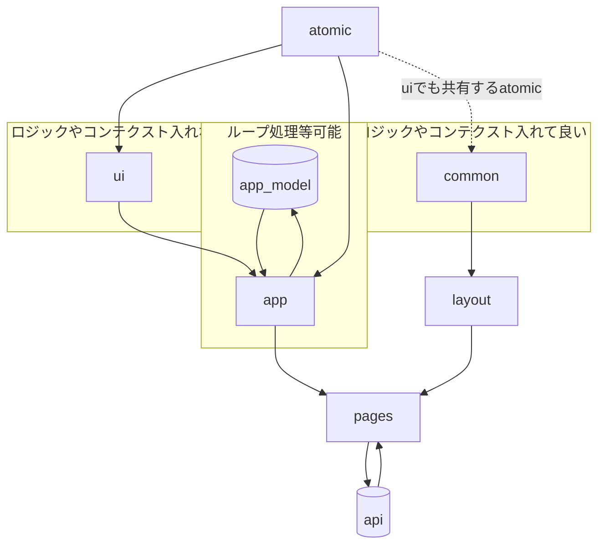

# Getting Started with UnoCSS and Nextjs

## Configuration

#### 1. Installing :

node 16.5.0

```bash
pnpm i
```

#### 2. develop :

```bash
pnpm dev
```

## concept

- atomic : html タグの拡張
- ui : atomic を組み合わせたもの
- common : サイト全体で使われるパーツ
- layout : 主に common を組み合わせる場所
- app : page 固有の部分。紐づく model(データ等)ファイルを持つ。ループ処理は主にここで
- pages : ページ。data fetch, app,layout を組み合わせる場所

atomic > ui > app > pages

common > layout > pages

※原則同一ディレクトリ内で再度 import はしない



## Usage

pages/

```tsx
/* index.tsx */
import type { ReactElement } from 'react'
import App from '@/components/app/Home
import Layout from '@/components/layout'

import type { NextPageWithLayout } from '@/pages/_app'

const Page: NextPageWithLayout = () => {
  return <App />
}

Page.getLayout = function getLayout(page: ReactElement) {
  return (
    <Layout>
      {page}
    </Layout>
  )
}

export default Page


```

components/\*\*

スタイリングについては className よりも属性値で設定することを推奨します。

```jsx
const Component = ({xxx,xxxx}:Props) => {
  return (
    <>

        <span text='blue 5xl hover:red' cursor='default'>
          Nextjs
        </span>
        <div className='i-carbon-car inline-block' text='4xl' />
        <flex gap-8>
          <button w='w-10rem' className='btn'>Button 1</button>
         <button w=' w-10rem'className='btn'>Button 2</button>
        </flex>
    </flex>
  );
};
```

<br>

## scaffold

コンポーネントを作成する場合は npm scripts から作成可能です。

```bash

pnpm generate

# 対話形式で作成してください。

```
